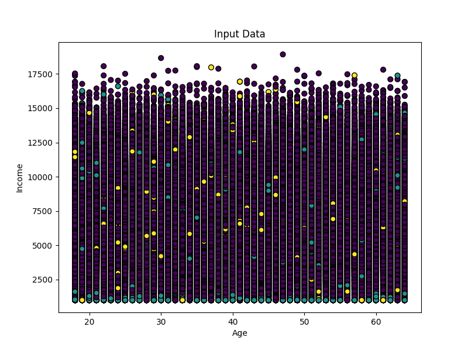
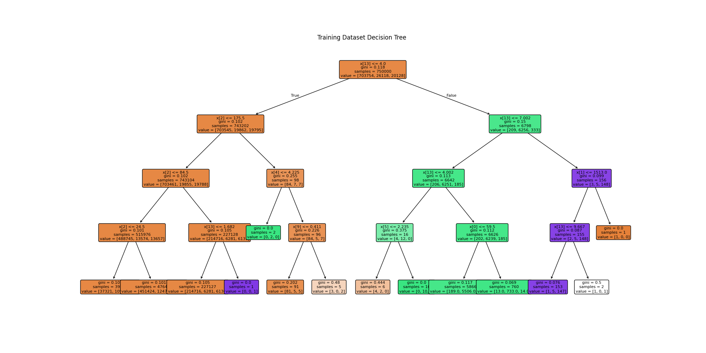
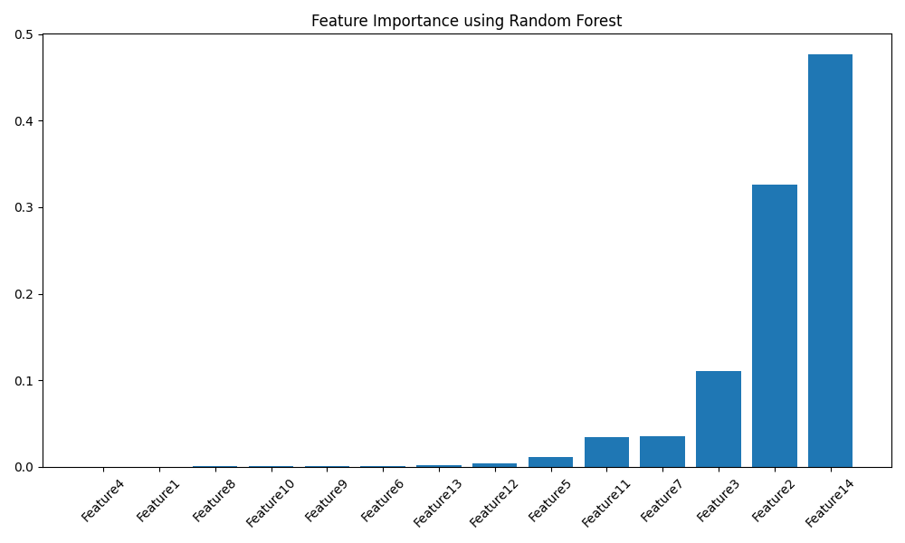
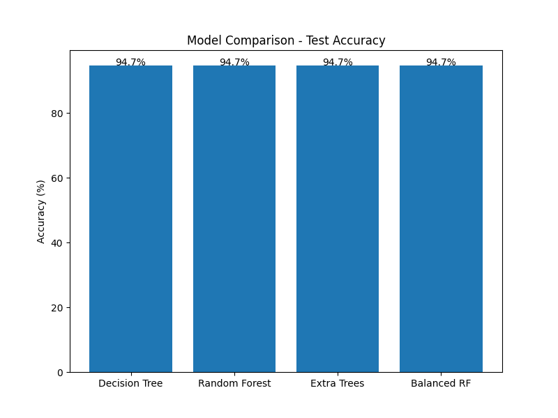

# Assignment 3 - Decision Tree Classifier

This project demonstrates the implementation of a Decision Tree Classifier using Python and Scikit-learn.

## Input Data Visualization

---

## Training Decision Tree

---

## Testing Decision Tree

---

## Feature Importance

---

## Model Comparison Summary

---

## Technologies Used

- Python
- Scikit-learn
- NumPy
- Matplotlib
- Google Colab

---

## Models Used

- Decision Tree
- Random Forest
- Extra Trees
- Balanced Random Forest

## Author
Kabrah Anwaar
